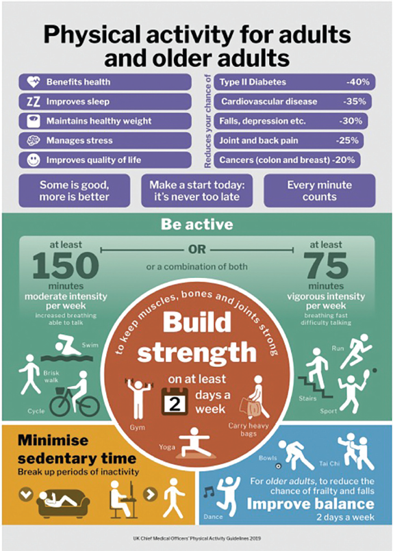

# Diseño del Estudio
En esta sección, analizaremos la composición del conjunto de datos, centrándonos específicamente en las variables disponibles. Desde una perspectiva constructiva, como se mencionó anteriormente, el conjunto de datos es muy básico. Por lo tanto, para generar resultados precisos sobre obesidad, problemas de salud u otros resultados relacionados, es necesario considerar variables adicionales.

Existen numerosas variables relevantes para el análisis de la obesidad, como el tiempo dedicado al ejercicio físico, la práctica regular de actividad física, las horas diarias que se pasa sentado y otros factores relacionados con el estilo de vida. Entre estas, las variables relacionadas con la actividad física destacan de forma intuitiva, ya que el ejercicio está estrechamente vinculado al gasto energético y la salud general.

## Hechos Cientificos Relacionados

Estudios cientificos destacan constantemente que la actividad física y el ejercicio desempeñan un papel crucial en la regulación del peso corporal y los niveles de obesidad. El ejercicio regular aumenta el gasto energético, ayuda a reducir la grasa corporal y disminuye el riesgo de obesidad y otros problemas de salud.

> *"A minimum of 150 to 300 minutes of moderate physical activity per week or 75 to 150 minutes of vigorous physical activity weekly is essential to prevent weight regain, increase weight loss, and improve fitness."*
>
> — Niemiro, G. M., Rewane, A., & Algotar, A. M. (2023, November 17).

Un artículo publicado en **Clinical Medicine**, la revista oficial del *Royal College of Physicians* (Londres), fomenta la adopción de actividad física recurrente debido a sus beneficios y la reducción de problemas de salud asociados al fitness.

*Raiman, L., Amarnani, R., Abdur-Rahman, M., Marshall, A., & Mani-Babu, S. (2023). The role of physical activity in obesity*

### Variable Adicional Propuesta
Por consiguiente, se propone una variable adicional denominada **"Actividad Física"**. Esta variable tiene una importancia significativa para el análisis, la cual realmente podría considerarse tanto cualitativa **(Activo/Normal/Bajo)** como cuantitativa **(horas semanales)**; sin embargo, para facilidad el estudio, se recomienda manejarlo como cualitativa, esto para facilitar una respuesta por parte de las personas, ya que sí se maneja cuantitativamente, podría haber errores en cuanto a las estimaciones de las personas acerca de su actividad física.

## Referencias APA

* Raiman, L., Amarnani, R., Abdur-Rahman, M., Marshall, A., & Mani-Babu, S. (2023). *The role of physical activity in obesity: let’s actively manage obesity. Clinical Medicine, 23(4), 311-317*. <https://doi.org/10.7861/clinmed.2023-0152>
* Niemiro, G. M., Rewane, A., & Algotar, A. M. (2023, 17 noviembre). *Exercise and Fitness Effect on Obesity. StatPearls - NCBI Bookshelf.* <https://www.ncbi.nlm.nih.gov/books/NBK539893/>
