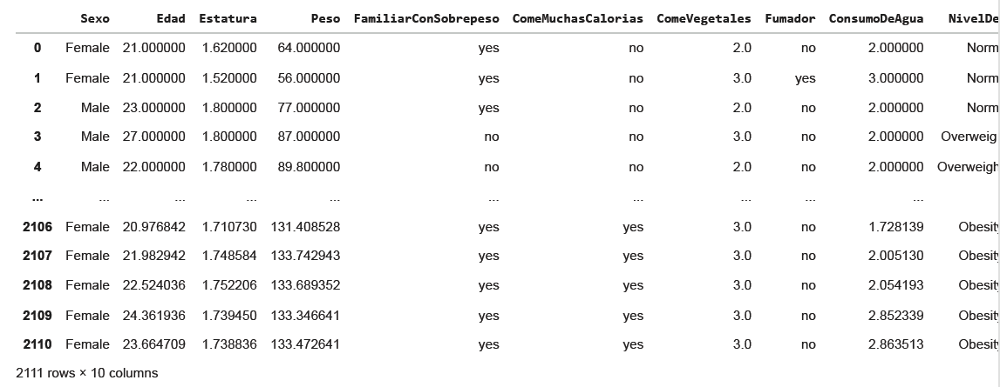

# Exploración de Datos
## Introducción
La obesidad es uno de los retos sanitarios más urgentes en Latinoamérica, actuando como detonante de múltiples enfermedades crónicas más allá de la estética. Este reporte analiza datos reales de individuos de Colombia, Perú y México con un objetivo claro: identificar qué hábitos y factores biológicos determinan los distintos niveles de obesidad, para comprender sus causas subyacentes más allá de las cifras simples.

## Metodología

Para lograr un entendimiento profundo de los datos y cumplir con el objetivo del estudio se baso en la siguiente metodología:

* **Inspección de datos:** Carga del dataset para identificar dimensiones (filas y columnas) y clasificar las variables según su naturaleza técnica (cuantitativas vs. cualitativas).

* **Evaluación Crítica de Calidad:** Análisis de la subjetividad de los datos, identificando limitaciones en variables que carecen de unidades de medida estándar (ej. consumo de agua o calorías) para proponer mejoras en la recolección futura.

* **Análisis de la Variable Objetivo:** Visualización de la distribución de la variable Nivel de Obesidad para verificar el balance de las clases y detectar posibles sesgos en la muestra.

* **Procesamiento Técnico:** Uso de Python en el entorno Google Colab para la manipulación estadística y generación de gráficos.

* **Interpretación de datos obtenidos:** A partir del procesamiento técnico se encontrarán comportamientos, tendencias u patrones que puedan ayudarnos a entender el funcionamiento del sistema o conjunto de datos.

### Disclaimer
Como se mencionó anteriormente, vamos a utilizar herramientas de programación de Python + IA, más específicamente en Google Colab debido a su flexibilidad y facilidad de uso.

### Carga de Datos
Vamos a cargar el dataset para ver cuánta información tenemos.


> Python Code


```python
# importar dataset y librerias necesarias
from google.colab import drive
import pandas as pd
import numpy as np
import matplotlib.pyplot as plt
import seaborn as sns

df = pd.read_csv('/content/drive/MyDrive/Inteligencia Artificial I/A1.1 Obesidad.csv')
```



El conjunto de datos parece tener 2111 filas y 10 columnas, lo cual es un buen tamaño para un conjunto de datos. Ahora veamos con qué tipo de variables vamos a trabajar.

### Variables en el dataset y su tipo de datos
Vamos a revisar las variables y su tipo de datos

> Python Code


```python
# ver el tipo de variable
df.dtypes
```

|Variable|Tipo de dato|
|--------|------------|
|Sexo	|object|
|Edad	|float64|
|Estatura	|float64|
|Peso|	float64|
|FamiliarConSobrepeso|	object|
|ComeMuchasCalorias|	object|
|ComeVegetales	|float64|
|Fumador	|object|
|ConsumoDeAgua|float64|
|NivelDeObesidad |object|


Como apreciamos, tenemos dos tipos de variables, “float64” y “Object”, variables que para efectos técnicos vamos a expresar como cuantitativas (números) y cualitativas (categorías) respectivamente.

### Aspectos Generales
A simple vista, el conjunto de datos parece bastante general y básico, nada específico; después de todo, solo contamos con diez variables. Además, algunas variables parecen ser subjetivas más que específicas, como *"ComeMuchasCalorias"*. Considerando el factor humano, necesitaríamos establecer un rango de cuántas calorías se consideran muchas y cuántas se consideran menos. En cualquier caso, también debemos considerar que la persona promedio en Colombia, México y Perú no puede responder a un rango específico de calorías; por lo tanto, parece apropiado tratar esta variable como una categoría en lugar de un número. Sin embargo, a modo de sugerencia, sería más específico usar categorías como *(Alto/Normal/Bajo).*

Otras variables también parecen ser muy subjetivas, como *"ComeVegetales"* y *"ConsumoDeAgua"*, ya que el conjunto de datos no especifica si las cifras de ambas variables tienen una unidad de medida. Por lo tanto, parece correcto tratarlas como un consumo relativo, pero sería muy útil que se especificaran las cifras como frecuencia semanal, litros, galones o cualquier otra unidad.

Ahora bien, si hablamos de niveles de obesidad, podemos centrarnos en esa variable, que parece categórica. Para ver cuántas personas tienen diferentes niveles de obesidad, vamos a graficar los datos para ver la distribución.

### Distribución de niveles de obesidad
Demos un pequeño chequeo a como estan distribuidos los niveles de obesidad y el numero de personas


> Python Code

```python
conteo = df["NivelDeObesidad"].value_counts()
total = conteo.sum()

plt.figure()
plt.bar(conteo.index, conteo.values)

for i, valor in enumerate(conteo.values):
    porcentaje = valor / total * 100
    plt.text(i, valor, f"{porcentaje:.1f}%",
             ha="center", va="bottom")

plt.xlabel("Tipo de obesidad")
plt.ylabel("Número de personas")
plt.title("Distribución de personas por tipo de obesidad")
plt.xticks(rotation=90)
plt.show()
```


> Distribución Porcentual de Niveles de Obesidad

Según el gráfico, los niveles de obesidad parecen estar bastante bien distribuidos entre sus diferentes categorías, siendo la obesidad tipo 1 la más común entre los datos.

*Nota: Debido a la buena distribución podriamos inferir que los datos son generados, solo como comentario ya que es extraño que eso suceda de esa forma.*
