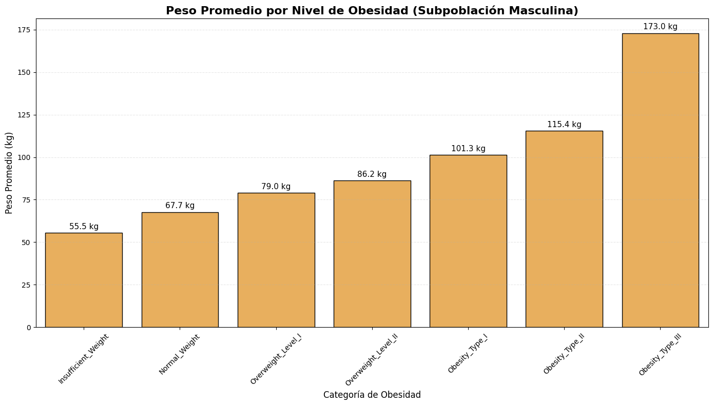
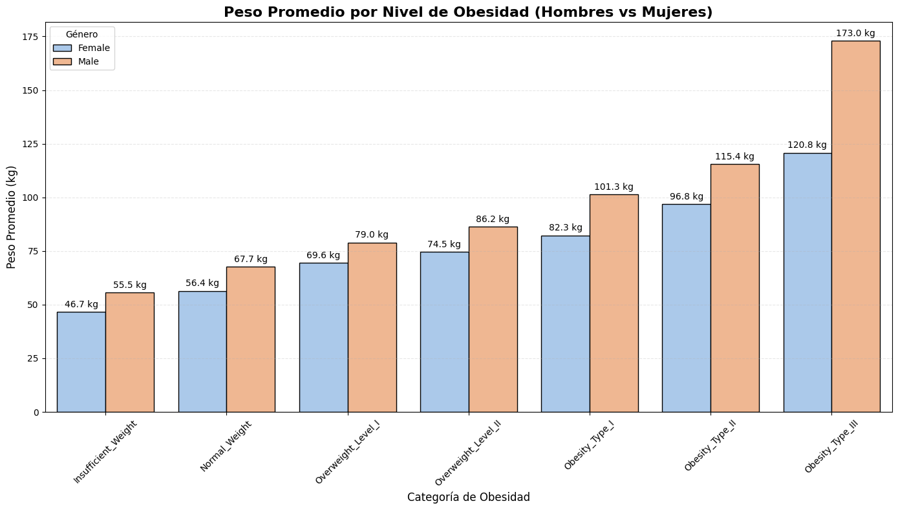

# Analisis Gráfico
Dada la alta variabilidad del peso individual, calculamos el **peso promedio** para cada categoría de obesidad. Esto nos permite identificar tendencias y patrones claros sin el ruido de los datos individuales.

**Subpoblación Seleccionada:** para este análisis gráfico, se seleccionó específicamente a la subpoblación masculina. Esta segmentación nos permite examinar la relación entre el peso y los niveles de obesidad de forma aislada en un solo sexo, facilitando la detección de patrones de salud y tendencias de peso.

### Graficar Subpoblación


> Python Code


```python
# Establecer dataframe de hombres
df_hombres = df[df['Sexo'] == 'Male'] 

# Configuración del tamaño
plt.figure(figsize=(14, 8))

# Orden de las categorías
orden_niveles = [
    'Insufficient_Weight',
    'Normal_Weight',
    'Overweight_Level_I',
    'Overweight_Level_II',
    'Obesity_Type_I',
    'Obesity_Type_II',
    'Obesity_Type_III'
]

# 2. CREAR EL GRÁFICO (Usando solo df_hombres)
ax = sns.barplot(
    data=df_hombres,       # Usamos el dataframe filtrado
    x='NivelDeObesidad',        # Asegúrate que este sea el nombre real de tu columna
    y='Peso',            # Variable de peso
    order=orden_niveles,
    color='#ffb347',       # Un color naranja pastel (o usa palette='Oranges')
    errorbar=None,
    edgecolor='black'
)

# Poner los números arriba de las barras
for container in ax.containers:
    ax.bar_label(container, fmt='%.1f kg', padding=3, fontsize=11)

# Títulos y Etiquetas
plt.title('Peso Promedio por Nivel de Obesidad (Subpoblación Masculina)', fontsize=16, fontweight='bold')
plt.xlabel('Categoría de Obesidad', fontsize=12)
plt.ylabel('Peso Promedio (kg)', fontsize=12)
plt.xticks(rotation=45)
plt.grid(axis='y', linestyle='--', alpha=0.3)

plt.tight_layout()
plt.show()
```





**Interpretación de Resultados de Subpoblación Masculina:**
El análisis del peso promedio en hombres revela dos comportamientos distintos:

* **Crecimiento Escalonado:** Desde el "Peso Insuficiente" (55.5 kg) hasta la "Obesidad Tipo II" (115.4 kg), el aumento de peso es gradual y constante. En estas primeras 6 categorías, los saltos son moderados, oscilando entre los 8 y 15 kg de diferencia entre cada nivel.

* **El Salto Crítico en Tipo III:** La tendencia se rompe drásticamente al llegar a la Obesidad Tipo III. Aquí, el peso promedio se dispara a 173.0 kg, lo que representa un aumento de casi 60 kg respecto al nivel anterior.

Esto dos comportamientos nos indican que la "Obesidad Tipo III" en hombres no es simplemente un paso más en la escala, sino un estado extremo. Para que un hombre sea clasificado en esta categoría, su masa corporal debe ser desproporcionadamente alta en comparación con los niveles previos, lo que sugiere que el hombre promedio tiende a tener un perfil de riesgo mayor en cuestiones de salud relacionadas a la obesidad.


# Extra
## Analisis de las dos Subpoblaciones (Masculina / Femenina)

Para una mejor comparación en el analisis, este estudio se dio a la tarea de comparar a su vez la población femenina con la masculina para una mejor comprensión de los datos.

### Graficar Subpoblaciónes


> Python Code


```python
# Configuración del tamaño
plt.figure(figsize=(14, 8))

# Orden de las categorías
orden_niveles = [
    'Insufficient_Weight',
    'Normal_Weight',
    'Overweight_Level_I',
    'Overweight_Level_II',
    'Obesity_Type_I',
    'Obesity_Type_II',
    'Obesity_Type_III'
]

# CREAR EL GRÁFICO DE BARRAS
# estimator=np.mean le dice que calcule el PROMEDIO de peso automáticamente
ax = sns.barplot(
    data=df,
    x='NivelDeObesidad',
    y='Peso',
    hue='Sexo',
    order=orden_niveles,
    palette='pastel',
    errorbar=None,  # Quitamos las líneas de error para que se vea más limpio aún
    edgecolor='black' # Borde negro para que se definan bien las barras
)

# Poner numeros arriba de las barras
for container in ax.containers:
    ax.bar_label(container, fmt='%.1f kg', padding=3, fontsize=10)

# Títulos y Etiquetas amigables
plt.title('Peso Promedio por Nivel de Obesidad (Hombres vs Mujeres)', fontsize=16, fontweight='bold')
plt.xlabel('Categoría de Obesidad', fontsize=12)
plt.ylabel('Peso Promedio (kg)', fontsize=12)
plt.xticks(rotation=45)
plt.legend(title='Género')
plt.grid(axis='y', linestyle='--', alpha=0.3)

plt.tight_layout()
plt.show()
```




El gráfico revela un patrón consistente: la subpoblación masculina presenta un peso promedio más alto en todas las categorías de obesidad, en comparación con el valor de referencia femenino. Inicialmente, esta diferencia se mantiene estable, rondando los 10 kg en las primeras categorías.

Sin embargo, se observa una **distinción notable** en la categoría de "Obesidad Tipo III". En este caso, el peso promedio de los hombres se dispara a aproximadamente 173 kg, lo que crea una enorme diferencia de aproximadamente 50 kg en comparación con las mujeres de la misma categoría.

Esto confirma lo anteriormente mencionado en el análisis de la subpoblación masculina, de esto se puede inferir que en el conjunto de datos analizado, los hombres tienden a tener un mayor riesgo de obesidad en comparación a las mujeres.

## Conclusión

Con los análisis previamente hechos, se confirma las distinciones entre niveles de obesidad de hombres y mujeres, siendo más presente un nivel de obesidad alta en la población masculina, dato que puede ser de utilidad para tomar en consideración si es que se pertenece al sexo masculino, sugiriendo un mayor cuidado con respecto al estilo de vida y salud.

En cuanto a las mujeres, también están presentes niveles altos de obesidad; sin embargo, en comparación con el sexo masculino, es riesgo de pertenecer a algún tipo de obesidad relativamente menor; De igual manera se sugiere precaución en caso de pertenecer a cualquier grupo, debido a que es un problema que afecta tanto a hombres como mujeres.

La naturaleza del conjunto de datos es cualitativa y cuantitativa. Además, las variables que tenemos parecen ser básicas y subjetivas, lo cual es muy útil para el análisis general de datos, pero para el procesamiento de datos mas especifico suele ser difícil llegar a una conclusión sólida debido a la falta de otros factores, como la dieta específica, el ejercicio, la calidad del sueño, estilo de vida y otros factores que podrian modelar con mejor precision el comportamiento.

Hablando de ciertas areas de oportunidad, el conjunto de datos debería ser más específico en aspectos como "ConsumoDeAgua" y "ComeVegetales", debido a la falta de unidades de medida o especificación de frecuencia para estas variables, para este estudio, se consideraron como consumos relativos.

En general, como se mencionó anteriormente, este conjunto de datos sirve como un buen ejemplo para el procesamiento de datos de aprendizaje automático estadístico, ya que demuestra claramente cómo distintas variables pueden influir en un resultado categórico.

## Referencias APA

* Raiman, L., Amarnani, R., Abdur-Rahman, M., Marshall, A., & Mani-Babu, S. (2023). *The role of physical activity in obesity: let’s actively manage obesity. Clinical Medicine, 23(4), 311-317*. <https://doi.org/10.7861/clinmed.2023-0152>
* Niemiro, G. M., Rewane, A., & Algotar, A. M. (2023, 17 noviembre). *Exercise and Fitness Effect on Obesity. StatPearls - NCBI Bookshelf.* <https://www.ncbi.nlm.nih.gov/books/NBK539893/>
