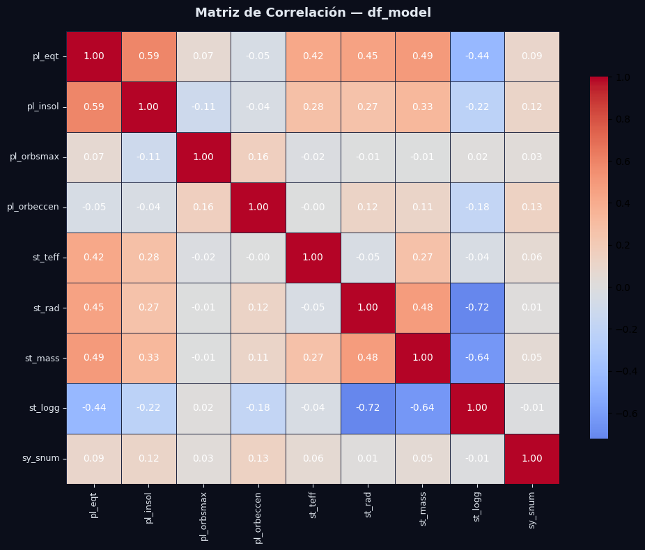

# Limpieza y preparación de datos

En este apartado se buscaran problemas relacionados a la falta de datos, datos atipicos, sesgos, etc, todo lo que pueda afectar nuestro analisis si no lo tratamos debidamente.

>PythonCode


```python
# ── Calcular % de nulos por columna ─────────────────────────────────────────
nulls = (df_raw.isnull().mean() * 100).sort_values(ascending=True)

# ── Color por umbral ─────────────────────────────────────────────────────────
def get_color(pct):
    if pct >= 50:
        return "#fc8181"   # rojo  — más de 50% nulos
    elif pct >= 20:
        return "#f6ad55"   # naranja — 20–50%
    else:
        return "#68d391"   # verde  — menos de 20%

colors = [get_color(p) for p in nulls.values]

# ── Figura ───────────────────────────────────────────────────────────────────
fig, ax = plt.subplots(figsize=(12, len(nulls) * 0.32 + 2))
fig.patch.set_facecolor("#0b0e1a")
ax.set_facecolor("#111628")

bars = ax.barh(nulls.index, nulls.values, color=colors, height=0.7, edgecolor="none")

# Etiquetas con el % al final de cada barra
for bar, val in zip(bars, nulls.values):
    ax.text(
        val + 0.5, bar.get_y() + bar.get_height() / 2,
        f"{val:.1f}%",
        va="center", ha="left",
        fontsize=7, color="#e2e8f0", fontfamily="monospace"
    )

# Líneas de referencia en 20% y 50%
for xline, label in [(20, "20%"), (50, "50%")]:
    ax.axvline(xline, color="#4fd1c5", linestyle="--", linewidth=0.8, alpha=0.6)
    ax.text(xline + 0.3, len(nulls) - 0.5, label,
            color="#4fd1c5", fontsize=8, va="top", fontfamily="monospace")

# Estilo de ejes
ax.set_xlim(0, 110)
ax.set_xlabel("% de valores nulos", color="#a0aec0", fontsize=10, labelpad=10)
ax.tick_params(axis="x", colors="#a0aec0", labelsize=8)
ax.tick_params(axis="y", colors="#e2e8f0", labelsize=7.5)
ax.spines[["top", "right", "left", "bottom"]].set_visible(False)
ax.grid(axis="x", color="#1e2540", linewidth=0.6)
ax.xaxis.tick_top()
ax.xaxis.set_label_position("top")

# Título
fig.suptitle(
    "% de valores nulos por columna — PSCompPars (N=6,107)",
    color="#e2e8f0", fontsize=13, fontweight="bold", y=1.01, x=0.5
)

# Leyenda
patches = [
    mpatches.Patch(color="#68d391", label="< 20% nulos"),
    mpatches.Patch(color="#f6ad55", label="20–50% nulos"),
    mpatches.Patch(color="#fc8181", label="> 50% nulos"),
]
ax.legend(handles=patches, loc="lower right", framealpha=0.2,
          labelcolor="#e2e8f0", fontsize=8, facecolor="#111628")

plt.tight_layout()

# ── Resumen en consola ───────────────────────────────────────────────────────
print(f"\nTotal columnas: {len(nulls)}")
print(f"  > 50% nulos:  {(nulls >= 50).sum()} columnas")
print(f"  20–50% nulos: {((nulls >= 20) & (nulls < 50)).sum()} columnas")
print(f"  < 20% nulos:  {(nulls < 20).sum()} columnas")
```


```text
Total columnas: 84
  > 50% nulos:  9 columnas
  20–50% nulos: 12 columnas
  < 20% nulos:  63 columnas
```


WOW, increible grafica, con esto podemos darnos cuenta de cuantas columnas con valores faltantes tenemos, afortunadamente nuestra variable de interes, **(pl_eqt)**, solo le falta el 25% de los dato, es decir, tenemos 75% de datos que si son relevantes.

Ahora, como podemos ver, hay variables que tienen 50% de los datos faltantes o incluso hay variables con 60 a 70 % de datos faltantes, y realmente con eso no podriamos trabajar ya que solo contariamos con el 20 -30% de los datos y no seria estadisticamente confiable trabajar con ellos, por lo tanto, definiremos que las variables con un porcentaje mayor al 50% seran automaticamente descartadas.

Aunado a esto, solo 12 columnas tienen valores nulos mayores al 50%, por lo cual no representaria un riesgo si las quitamos.


### Filtrar dataset por valores faltantes por columna

>PythonCode


```python
print(f"Shape original:  {df_raw.shape}  ({df_raw.shape[1]} columnas, {df_raw.shape[0]} filas)")

# ── Identificar y eliminar columnas con más del 50% de nulos ─────────────────
umbral = 0.50
nulos_pct = df_raw.isnull().mean()
cols_eliminar = nulos_pct[nulos_pct > umbral].index.tolist()

print(f"\nColumnas eliminadas ({len(cols_eliminar)}) — más del 50% de nulos:")
for col in cols_eliminar:
    print(f"  - {col:30s}  {nulos_pct[col]*100:.1f}%")

# ── Dataset limpio ────────────────────────────────────────────────────────────
df_clean = df_raw.drop(columns=cols_eliminar)

print(f"\nShape resultante: {df_clean.shape}  ({df_clean.shape[1]} columnas, {df_clean.shape[0]} filas)")
```


>Output

```text
Shape original:  (6107, 84)  (84 columnas, 6107 filas)

Columnas eliminadas (9) — más del 50% de nulos:
  - pl_bmasseerr1                   51.8%
  - pl_bmasseerr2                   51.8%
  - pl_bmassjerr1                   51.8%
  - pl_bmassjerr2                   51.8%
  - pl_orbeccenerr1                 69.9%
  - pl_orbeccenerr2                 69.9%
  - pl_eqterr1                      70.8%
  - pl_eqterr2                      70.8%
  - st_spectype                     62.8%

Shape resultante: (6107, 75)  (75 columnas, 6107 filas)
```


Del mismo modo, puede que haya ciertos datos atipicos, o datos que se salgan de nuestro rango intercuartil, Q3-Q1, para abarcar este problema, primero veamos algunas metricas estadisticas, minimos, maximos, para ver estos outliers, esto utlizando el metodo de tukey, donde los datos que se salgan de rango intercuartil, seran catalogados como outliers, asi mismo, veamos la cantidad de outliers por columna de la misma forma que vimos los datos faltantes.

Logicamente esto solo aplica para columnas con valores numericos, las variables categoricas, quedan excluidas para este caso.


### Verificar *outliers*


>PythonCode


```python
# ── Seleccionar solo columnas numéricas ──────────────────────────────────────
df_num = df_clean.select_dtypes(include="number")

# ── Estadísticas descriptivas ────────────────────────────────────────────────
print("ESTADÍSTICAS DESCRIPTIVAS:")
print(df_num.describe().T.to_string())

# ── Método de Tukey: detectar outliers por columna ──────────────────────────
Q1 = df_num.quantile(0.25)
Q3 = df_num.quantile(0.75)
IQR = Q3 - Q1

lower = Q1 - 1.5 * IQR
upper = Q3 + 1.5 * IQR

outliers_pct = {}
for col in df_num.columns:
    mask = (df_num[col] < lower[col]) | (df_num[col] > upper[col])
    outliers_pct[col] = mask.sum() / df_num[col].notna().sum() * 100

outliers_series = pd.Series(outliers_pct).sort_values(ascending=True)

# ── Gráfica ──────────────────────────────────────────────────────────────────
def get_color(pct):
    if pct >= 10:
        return "#fc8181"
    elif pct >= 5:
        return "#f6ad55"
    else:
        return "#68d391"

colors = [get_color(p) for p in outliers_series.values]

fig, ax = plt.subplots(figsize=(12, len(outliers_series) * 0.35 + 2))
fig.patch.set_facecolor("#0b0e1a")
ax.set_facecolor("#111628")

bars = ax.barh(outliers_series.index, outliers_series.values, color=colors, height=0.7, edgecolor="none")

for bar, val in zip(bars, outliers_series.values):
    ax.text(
        val + 0.1, bar.get_y() + bar.get_height() / 2,
        f"{val:.1f}%",
        va="center", ha="left",
        fontsize=7, color="#e2e8f0", fontfamily="monospace"
    )

for xline, label in [(5, "5%"), (10, "10%")]:
    ax.axvline(xline, color="#4fd1c5", linestyle="--", linewidth=0.8, alpha=0.6)
    ax.text(xline + 0.1, len(outliers_series) - 0.5, label,
            color="#4fd1c5", fontsize=8, va="top", fontfamily="monospace")

ax.set_xlim(0, outliers_series.max() * 1.15)
ax.set_xlabel("% de outliers (Tukey)", color="#a0aec0", fontsize=10, labelpad=10)
ax.tick_params(axis="x", colors="#a0aec0", labelsize=8)
ax.tick_params(axis="y", colors="#e2e8f0", labelsize=7.5)
ax.spines[["top", "right", "left", "bottom"]].set_visible(False)
ax.grid(axis="x", color="#1e2540", linewidth=0.6)
ax.xaxis.tick_top()
ax.xaxis.set_label_position("top")

fig.suptitle(
    "% de outliers por columna — Método de Tukey (IQR × 1.5)",
    color="#e2e8f0", fontsize=13, fontweight="bold", y=1.01
)

patches = [
    mpatches.Patch(color="#68d391", label="< 5% outliers"),
    mpatches.Patch(color="#f6ad55", label="5–10% outliers"),
    mpatches.Patch(color="#fc8181", label="> 10% outliers"),
]
ax.legend(handles=patches, loc="lower right", framealpha=0.2,
          labelcolor="#e2e8f0", fontsize=8, facecolor="#111628")

plt.tight_layout()
plt.show()

# ── Resumen en consola ───────────────────────────────────────────────────────
print(f"\nTotal columnas numéricas analizadas: {len(outliers_series)}")
print(f"  > 10% outliers: {(outliers_series >= 10).sum()} columnas")
print(f"  5–10% outliers: {((outliers_series >= 5) & (outliers_series < 10)).sum()} columnas")
print(f"  < 5%  outliers: {(outliers_series < 5).sum()} columnas")

```


>Output


```text
ESTADÍSTICAS DESCRIPTIVAS:
                  count          mean           std           min          25%          50%          75%           max
sy_snum          6107.0      1.103324  3.419091e-01  1.000000e+00     1.000000     1.000000     1.000000  4.000000e+00
sy_pnum          6107.0      1.771574  1.157888e+00  1.000000e+00     1.000000     1.000000     2.000000  8.000000e+00
disc_year        6106.0   2016.923354  4.925059e+00  1.992000e+03  2014.000000  2016.000000  2021.000000  2.026000e+03
pl_controv_flag  6107.0      0.007860  8.831383e-02  0.000000e+00     0.000000     0.000000     0.000000  1.000000e+00
pl_orbper        5784.0  73996.569733  5.288286e+06  9.070629e-02     4.352093    11.129002    39.729264  4.020000e+08
pl_orbpererr1    5292.0  90456.414349  6.461142e+06  0.000000e+00     0.000012     0.000086     0.001502  4.700000e+08
pl_orbpererr2    5292.0 -20661.730942  1.376695e+06 -1.000000e+08    -0.001505    -0.000087    -0.000012  0.000000e+00
pl_orbperlim     5784.0     -0.001037  3.219390e-02 -1.000000e+00     0.000000     0.000000     0.000000  0.000000e+00
pl_orbsmax       5791.0     15.735019  3.503026e+02  4.400000e-03     0.052395     0.102000     0.302920  1.900000e+04
pl_orbsmaxerr1   3850.0      1.824260  8.409218e+01  0.000000e+00     0.000702     0.002000     0.015225  5.205000e+03
pl_orbsmaxerr2   3850.0     -0.968793  3.372312e+01 -2.060000e+03    -0.016000    -0.002000    -0.000723  0.000000e+00
pl_orbsmaxlim    5792.0     -0.000518  2.275471e-02 -1.000000e+00     0.000000     0.000000     0.000000  0.000000e+00
pl_rade          6057.0      5.830228  5.441548e+00  3.098000e-01     1.820000     2.838000    11.920000  8.720587e+01
pl_radeerr1      4201.0      0.518881  1.500957e+00  0.000000e+00     0.120000     0.269016     0.560449  6.891000e+01
pl_radeerr2      4201.0     -0.416619  9.402166e-01 -3.250610e+01    -0.450000    -0.210000    -0.110000  0.000000e+00
pl_radelim       6057.0     -0.000660  2.569175e-02 -1.000000e+00     0.000000     0.000000     0.000000  0.000000e+00
pl_radj          6057.0      0.520173  4.855082e-01  2.763855e-02     0.162370     0.253000     1.069000  7.780000e+00
pl_radjerr1      4201.0      0.046294  1.339108e-01  0.000000e+00     0.011000     0.024000     0.050000  6.147738e+00
pl_radjerr2      4201.0     -0.037171  8.388587e-02 -2.900000e+00    -0.040146    -0.019000    -0.009814  0.000000e+00
pl_radjlim       6057.0     -0.000660  2.569175e-02 -1.000000e+00     0.000000     0.000000     0.000000  0.000000e+00
pl_bmasse        6076.0    404.870217  1.143461e+03  2.000000e-02     4.190000     9.220000   190.000000  9.534852e+03
pl_bmasselim     6076.0      0.033739  1.920577e-01 -1.000000e+00     0.000000     0.000000     0.000000  1.000000e+00
pl_bmassj        6076.0      1.274010  3.598153e+00  6.293000e-05     0.013200     0.029000     0.597250  3.000000e+01
pl_bmassjlim     6076.0      0.033739  1.920577e-01 -1.000000e+00     0.000000     0.000000     0.000000  1.000000e+00
pl_orbeccen      5190.0      0.079178  1.530268e-01  0.000000e+00     0.000000     0.000000     0.091000  9.500000e-01
pl_orbeccenlim   5190.0      0.052408  2.313562e-01 -1.000000e+00     0.000000     0.000000     0.000000  1.000000e+00
pl_insol         4290.0    417.530525  1.293466e+03  3.000000e-04    23.815000    98.773750   376.070250  4.490000e+04
pl_insolerr1     3614.0     41.453437  1.918754e+02  0.000000e+00     1.339250     5.916000    26.603500  8.100000e+03
pl_insolerr2     3614.0    -31.861127  1.559702e+02 -7.200000e+03   -22.040000    -5.243000    -1.237250  0.000000e+00
pl_insollim      4290.0      0.000000  0.000000e+00  0.000000e+00     0.000000     0.000000     0.000000  0.000000e+00
pl_eqt           4566.0    914.073611  4.641943e+02  3.400000e+01   568.000000   819.000000  1165.000000  4.050000e+03
pl_eqtlim        4566.0      0.000657  2.562699e-02  0.000000e+00     0.000000     0.000000     0.000000  1.000000e+00
ttv_flag         6107.0      0.079581  2.706653e-01  0.000000e+00     0.000000     0.000000     0.000000  1.000000e+00
st_teff          5826.0   5402.760599  1.749262e+03  4.150000e+02  4910.000000  5550.000000  5900.000000  5.700000e+04
st_tefferr1      5625.0     98.503044  7.202930e+01  1.000000e+00    59.760000    86.000000   120.800000  1.763100e+03
st_tefferr2      5625.0    -99.255015  7.369123e+01 -2.360240e+03  -125.000000   -86.250000   -58.140000 -1.000000e+00
st_tefflim       5826.0      0.000172  1.310131e-02  0.000000e+00     0.000000     0.000000     0.000000  1.000000e+00
st_rad           5803.0      1.506636  3.960867e+00  1.150000e-02     0.770000     0.952252     1.249795  8.847500e+01
st_raderr1       5645.0      0.189038  1.637888e+00  0.000000e+00     0.023000     0.051000     0.167000  1.045280e+02
st_raderr2       5644.0     -0.147651  8.628053e-01 -2.897000e+01    -0.106000    -0.050000    -0.023000  0.000000e+00
st_radlim        5803.0      0.000000  0.000000e+00  0.000000e+00     0.000000     0.000000     0.000000  0.000000e+00
st_mass          6100.0      0.937770  4.097536e-01  9.400000e-03     0.770000     0.940000     1.090000  1.094000e+01
st_masserr1      5828.0      0.084740  1.936105e-01  2.000000e-04     0.029000     0.048000     0.086000  1.002000e+01
st_masserr2      5827.0     -0.078574  1.883673e-01 -1.002000e+01    -0.080000    -0.048000    -0.029000  0.000000e+00
st_masslim       6100.0      0.000000  0.000000e+00  0.000000e+00     0.000000     0.000000     0.000000  0.000000e+00
st_met           5566.0      0.015162  1.885065e-01 -1.000000e+00    -0.080000     0.020000     0.130000  6.000000e-01
st_meterr1       5276.0      0.097280  6.994842e-02  1.000000e-03     0.040000     0.083000     0.140000  9.600000e-01
st_meterr2       5276.0     -0.103072  7.659205e-02 -1.000000e+00    -0.150000    -0.083000    -0.040000  0.000000e+00
st_metlim        5566.0      0.000000  2.681004e-02 -1.000000e+00     0.000000     0.000000     0.000000  1.000000e+00
st_logg          5799.0      4.383725  4.418676e-01  5.410000e-01     4.293000     4.453000     4.579000  8.070000e+00
st_loggerr1      5617.0      0.082640  8.162689e-02  0.000000e+00     0.029000     0.056000     0.103000  1.100000e+00
st_loggerr2      5617.0     -0.097217  1.020781e-01 -3.510000e+00    -0.150000    -0.073000    -0.030000  0.000000e+00
st_logglim       5799.0     -0.001035  3.215228e-02 -1.000000e+00     0.000000     0.000000     0.000000  0.000000e+00
ra               6107.0    233.178235  9.157285e+01  1.856063e-01   173.861919   284.998698   293.260901  3.599750e+02
dec              6107.0     18.268858  3.687894e+01 -8.812111e+01   -10.849739    39.212439    45.384333  8.686034e+01
sy_dist          6080.0    706.676932  1.194728e+03  1.301190e+00   101.748000   379.112500   835.865500  8.500000e+03
sy_disterr1      5973.0     58.563011  2.319003e+02  3.400000e-04     0.442100     4.145500    16.920000  2.600000e+03
sy_disterr2      5973.0    -65.325200  2.738783e+02 -2.840000e+03   -16.404000    -4.067000    -0.437200 -3.500000e-04
sy_vmag          5823.0     12.554730  3.062547e+00  8.720000e-01    10.633500    13.258000    14.948000  4.461000e+01
sy_vmagerr1      5815.0      0.098314  1.359836e-01  1.000000e-03     0.030000     0.077000     0.126000  3.100000e+00
sy_vmagerr2      5809.0     -0.099833  2.022661e-01 -1.192000e+01    -0.126000    -0.077000    -0.030000 -1.000000e-03
sy_kmag          5834.0     10.391023  2.993842e+00 -3.044000e+00     8.375000    11.149000    12.741250  3.311000e+01
sy_kmagerr1      5797.0      0.041557  2.541274e-01  1.100000e-02     0.020000     0.023000     0.031000  9.995000e+00
sy_kmagerr2      5785.0     -0.041576  2.600511e-01 -9.995000e+00    -0.031000    -0.023000    -0.020000 -1.100000e-02
sy_gaiamag       5778.0     12.263251  2.961386e+00  2.364310e+00    10.382700    12.984100    14.684800  2.018610e+01
sy_gaiamagerr1   5777.0      0.000643  1.809771e-03  1.120000e-04     0.000257     0.000364     0.000543  6.323200e-02
sy_gaiamagerr2   5777.0     -0.000643  1.809771e-03 -6.323200e-02    -0.000543    -0.000364    -0.000257 -1.120000e-04


Total columnas numéricas analizadas: 67
  > 10% outliers: 16 columnas
  5–10% outliers: 19 columnas
  < 5%  outliers: 32 columnas

```


Bien de momento ya hemos identificado los outliers y algunos valores faltantes que hemos eliminado por gran falta de datos. Realmente con los outliers no habria mucho problema ya que en si el maximo que se tiene es 20% de outliers, los cuales podriamos llenar con algun metodo de imputación y tecnicamente no deberia de tener un efecto negativo ya que el porcentaje de datos atipicos no es elevado.


### Subconjunto de variables

Segun el contexto de los datos, las variables con "err", son meramente incertidumbres de la medicion, pero no son un factor fisico directamente relacionado con el planeta, realmente no seria logico tratar de predecir su temperatura de equilibrio por medio de una incertidumbre, por lo cual un acercamiento inicial seria seleccionar un subconjunto de variables y trabajar con ellas, de esa forma, estariamos re alguna manera "reduciendo las dimensiones", sin eliminar esas variables que si bien, por contexto no serian de utilidad para la salida, si podrian servirnos para el contexto y expliración de datos.


Por lo tanto, gracias al contexto de los datos, utilizaremos las variables descritas al principio, las cuales cuentan con mas peso, segun fuentes. Estas son: 
-  `st_teff` (temperatura efectiva de la estrella)
- `st_rad` (radio estelar)
- `pl_orbsmax` (semieje mayor orbital)
- `pl_insol` (insolación recibida)
- `pl_orbeccen` (excentricidad orbital)
- `st_mass` (excentricidad orbital)
- `sy_snum` (numero de estrellas en el sistema)
- `st_logg` (Gravedad superficial estelar en escala logarítmica (log g, cgs))

De modo que estas serian nuestro subconjunto de variables


>PythonCode


```python
# Definir subconjunto de variables
# Subconjunto para el modelo
vars_modelo = ["pl_eqt", "pl_insol", "pl_orbsmax", "pl_orbeccen", "st_teff", "st_rad", "st_mass", "st_logg","sy_snum"]
df_subconjunto = df_clean[vars_modelo].copy()

### Matriz de correlación

# Debido a que puede haber la posibilidad de haber cierta colinearidad en los datos, veamos la correlacion en una matriz para ver la relacion de unas contra otras

# Matriz de correlación
corr = df_subconjunto.corr(method="pearson")

# Gráfica
fig, ax = plt.subplots(figsize=(10, 8))
fig.patch.set_facecolor("#0b0e1a")
ax.set_facecolor("#111628")

sns.heatmap(
    corr,
    annot=True,
    fmt=".2f",
    cmap="coolwarm",
    center=0,
    linewidths=0.5,
    linecolor="#1e2540",
    ax=ax,
    annot_kws={"size": 10, "color": "white"},
    cbar_kws={"shrink": 0.8}
)

ax.set_title("Matriz de Correlación — df_model",
             color="#e2e8f0", fontsize=13, fontweight="bold", pad=15)
ax.tick_params(colors="#e2e8f0", labelsize=9)

plt.tight_layout()
plt.savefig("correlacion_df_model.png", dpi=150, bbox_inches="tight", facecolor=fig.get_facecolor())
plt.show()

# Resumen numérico — correlación con pl_eqt ordenada por valor absoluto
print("\nCorrelación con pl_eqt (ordenado por valor absoluto):")
print(corr["pl_eqt"].drop("pl_eqt").abs().sort_values(ascending=False).to_string())

```


>Output



```text
Correlación con pl_eqt (ordenado por valor absoluto):
pl_insol       0.587371
st_mass        0.491618
st_rad         0.451124
st_logg        0.444563
st_teff        0.424145
sy_snum        0.092600
pl_orbsmax     0.066231
pl_orbeccen    0.051549

```


Increible matriz, cierto?, bueno, de aqui podemos ver varias cosas muy interesantes, podemos ver que al parecer las varibles que etan mas relacionadas con pl_eqt son:
-  pl_insol, muy logico ya que la insolacion esta estrechamente relacionada con la temperatura
- st_mass, tiene coherencia, ya que la masa de la estrella puede decir mucho de su efecto en los planetas
- st_rad, tiene sentido que el radio de la estrella sea influyente
- st_logg, valor alto absoluto, pero es negativo, podriamos quitarla
- st_teff, temperatura efectiva de la estrella, obviamente esta relacionada

De esto podemos ver ciertas cosas, podriamos eliminar stellar mass ya que esta relacionada con el radio, su informacion de cierta manera estaria capturada ahi. `st_logg`, realmente la relacion es negativa fuerte, podriamos quitarla sin problema. `sy_num`, al parecer el numero de estrellas no esta relacionado con la temperatura y en general no tiene relacion significativa con ninguna.

Ultima cosa: algo extraño es que `pl_orbsmax` no este relacionada con la temperatura, podria deberse a su relación con `pl_insol`, una opcion tambien podria ser quitarla.

RESUMEN:

Conservar: `pl_insol`, `st_teff` y `st_rad`. Las demas las eliminamos y creamos un dataframe con solo las variables de interes.


### Crear DF con las variables de interes


>Python code


```python
# crear dataframe con las variables de interes
vars_modelo = ["pl_eqt", "pl_insol", "st_teff", "st_rad"]
df_model = df_clean[vars_modelo].copy()

```
Ya que tenemos esas variables de interes, chequemos outliers y valors nulos dentro de ese dataframe que acabamos de crear


```python
ivars_modelo = ["pl_eqt", "pl_insol", "st_teff", "st_rad"]
df_model = df_clean[vars_modelo].copy()

# ── Calcular nulos y outliers ─────────────────────────────────────────────────
nulos = df_model.isnull().mean() * 100

Q1 = df_model.quantile(0.25)
Q3 = df_model.quantile(0.75)
IQR = Q3 - Q1
lower = Q1 - 1.5 * IQR
upper = Q3 + 1.5 * IQR

outliers = {}
for col in df_model.columns:
    mask = (df_model[col] < lower[col]) | (df_model[col] > upper[col])
    outliers[col] = mask.sum() / df_model[col].notna().sum() * 100
outliers = pd.Series(outliers)

# ── Figura con dos subplots ───────────────────────────────────────────────────
fig, axes = plt.subplots(1, 2, figsize=(14, 4))
fig.patch.set_facecolor("#0b0e1a")

def get_color_nulos(pct):
    if pct >= 50: return "#fc8181"
    elif pct >= 20: return "#f6ad55"
    else: return "#68d391"

def get_color_outliers(pct):
    if pct >= 10: return "#fc8181"
    elif pct >= 5: return "#f6ad55"
    else: return "#68d391"

for ax, series, title, color_fn, refs, ref_label in [
    (axes[0], nulos,    "% Valores Nulos",   get_color_nulos,    [(20, "20%"), (50, "50%")], "nulos"),
    (axes[1], outliers, "% Outliers (Tukey)", get_color_outliers, [(5, "5%"), (10, "10%")],  "outliers"),
]:
    ax.set_facecolor("#111628")
    colors = [color_fn(p) for p in series.values]
    bars = ax.barh(series.index, series.values, color=colors, height=0.5, edgecolor="none")

    for bar, val in zip(bars, series.values):
        ax.text(val + 0.3, bar.get_y() + bar.get_height() / 2,
                f"{val:.1f}%", va="center", ha="left",
                fontsize=9, color="#e2e8f0", fontfamily="monospace")

    for xline, label in refs:
        ax.axvline(xline, color="#4fd1c5", linestyle="--", linewidth=0.8, alpha=0.6)
        ax.text(xline + 0.2, len(series) - 0.1, label,
                color="#4fd1c5", fontsize=8, va="top", fontfamily="monospace")

    ax.set_xlim(0, max(series.values) * 1.3 + 5)
    ax.set_title(title, color="#e2e8f0", fontsize=11, fontweight="bold", pad=10)
    ax.tick_params(axis="x", colors="#a0aec0", labelsize=8)
    ax.tick_params(axis="y", colors="#e2e8f0", labelsize=9)
    ax.spines[["top", "right", "left", "bottom"]].set_visible(False)
    ax.grid(axis="x", color="#1e2540", linewidth=0.6)
    ax.xaxis.tick_top()
    ax.xaxis.set_label_position("top")

# Leyendas
for ax, color_fn, labels in [
    (axes[0], get_color_nulos,    ["< 20%", "20–50%", "> 50%"]),
    (axes[1], get_color_outliers, ["< 5%",  "5–10%",  "> 10%"]),
]:
    patches = [
        mpatches.Patch(color="#68d391", label=labels[0]),
        mpatches.Patch(color="#f6ad55", label=labels[1]),
        mpatches.Patch(color="#fc8181", label=labels[2]),
    ]
    ax.legend(handles=patches, loc="lower right", framealpha=0.2,
              labelcolor="#e2e8f0", fontsize=8, facecolor="#111628")

fig.suptitle("Estado de df_model — Nulos y Outliers", color="#e2e8f0",
             fontsize=13, fontweight="bold", y=1.03)

plt.tight_layout()
plt.savefig("estado_df_model.png", dpi=150, bbox_inches="tight", facecolor=fig.get_facecolor())
plt.show()

```

>Output


Bien, de estas graficas podemos ver que de forma general no hay mucho de que prepocuparse, los valores nulos de nuestro subconjunto no pasan del 30%  y los outliers no pasan del 11, sin problema podemos imputar.

Pero hay que tener cuidado, si vemos detenidamente, la variable objetivo tiene 25% de datos faltantes, si llenamos con KNN o algun otro metodo, estariamos produciendo sesgo, ya que estariamos poniendo/ inventando datos donde no hay.

Para que nuetras metricas estadisticas esten basadas en datos reales, podriamos elimianr esas observaciones, perderiamos 25% de los datos, pero, serian todos reales. Vamos a irnos por ese camino.


### Eliminar valores nulos de pl_eqt


>PythonCode


```python
# ── Eliminar filas donde pl_eqt es nulo ──────────────────────────────────────
df_model = df_model.dropna(subset=["pl_eqt"])

print(f"Filas antes: 6107")
print(f"Filas después: {len(df_model)}")
print(f"Filas eliminadas: {6107 - len(df_model)}")
print(f"\nNulos restantes por columna:")
print((df_model.isnull().mean() * 100).round(2).to_string())
```


>Output


```text
Filas antes: 6107
Filas después: 4566
Filas eliminadas: 1541

Nulos restantes por columna:
pl_eqt      0.00
pl_insol    7.88
st_teff     0.22
st_rad      0.35

```


bien, perdimos aproximadamente 1540 filas, pero aun contamos con 4566, lo cual es bastante bueno, ahora si, podemos llenar esos outliers con KNN, el cual encuentra los vecinos mas cercanos, los promedia y los llena, esto lo haremos para las variables de `pl_insol`,`st_teff` y `st_rad`

### Imputar valores faltantes con KNN


>Python Code


```python

from sklearn.impute import KNNImputer

# ── Imputación KNN sobre los predictores ─────────────────────────────────────
imputer = KNNImputer(n_neighbors=5)

df_model_imputed = pd.DataFrame(
    imputer.fit_transform(df_model),
    columns=df_model.columns,
    index=df_model.index
)

# ── Verificación ──────────────────────────────────────────────────────────────
print("Nulos después de KNN:")
print((df_model_imputed.isnull().mean() * 100).round(2).to_string())
print(f"\nShape final: {df_model_imputed.shape}")

```


>Output


```text
Nulos después de KNN:
pl_eqt      0.0
pl_insol    0.0
st_teff     0.0
st_rad      0.0

Shape final: (4566, 4)

```


Perfecto, ya no tenemos valores faltantes, vamos ahora con los outliers.

Perfectamente tambien podriamos usar KNN para remplazar los outliers, pero primero tendriamos que marcar esos datos atipicos como NaN, para que KNN los identifique como valores faltantes y luego los rellenaria con los datos de los planetas mas cercanos.

### Remplazar outliers con KNN


>Python Code


```python
# 1. Marcar outliers como NaN
Q1 = df_model_imputed.quantile(0.25)
Q3 = df_model_imputed.quantile(0.75)
IQR = Q3 - Q1
lower = Q1 - 1.5 * IQR
upper = Q3 + 1.5 * IQR

df_model_clean = df_model_imputed.copy()

for col in df_model_clean.columns:
    if col == "pl_eqt":  # la variable objetivo no la tocamos
        continue
    mask = (df_model_clean[col] < lower[col]) | (df_model_clean[col] > upper[col])
    df_model_clean.loc[mask, col] = np.nan

print("Nulos después de marcar outliers:")
print((df_model_clean.isnull().mean() * 100).round(2).to_string())

# 2. Reimputar con KNN
df_model_clean = pd.DataFrame(
    KNNImputer(n_neighbors=5).fit_transform(df_model_clean),
    columns=df_model_clean.columns,
    index=df_model_clean.index
)

print("\nNulos después de KNN:")
print((df_model_clean.isnull().mean() * 100).round(2).to_string())
print(f"\nShape final: {df_model_clean.shape}")

```


>Output


```text
Nulos después de marcar outliers:
pl_eqt       0.00
pl_insol    11.41
st_teff      6.22
st_rad       4.16

Nulos después de KNN:
pl_eqt      0.0
pl_insol    0.0
st_teff     0.0
st_rad      0.0

Shape final: (4566, 4)
```


Perfecto, con esto ya tendriamos nuestros datos limpios para trabajar, podemos seguir a la siguiente seccion para la construccion y comparación de nuestros modelos.

---

### Siguiente pagina

[>>>> Modelos](modelos.md)
