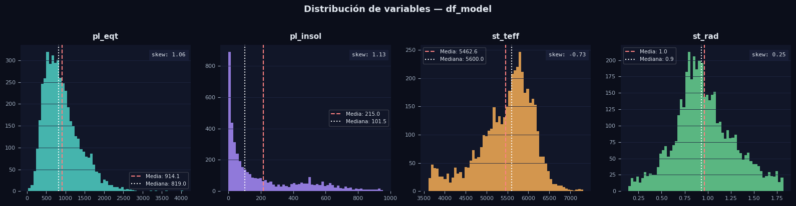
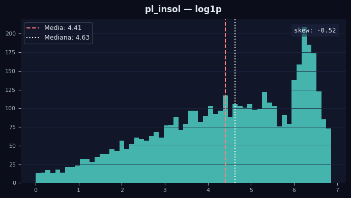

# What if ???

Esta seccion esta dedicada a explorar ciertos cambios que se hicieron en el dataset y los modelos, esto con el fin de ver como reacciona,
mas que nada por mera curiosidad y ver si en base a eso el modelo empeora o mejora.


Abarcaremos brevemente los siguiente escenarios:

#Seccion de What if?

1 - Qué pasaria si vieramos la distribución de los datos para encontrar alguna asimetria y corregirla, mejoraria el modelo?

2 - Qué tal si en vez de usar una seleccion de variables por contexto, buscamos la mejor combinacion de las variables para tratar de mejorarlo?

3 - Si creamos alguna interacción entre las variables, mejoraria el modelo?

4- si normalizamos los datos, el modelo mejoraria?


# 1) Ver distribucion

>PythoCode


```python
import matplotlib.pyplot as plt

fig, axes = plt.subplots(1, 4, figsize=(16, 4))
fig.patch.set_facecolor("#0b0e1a")

vars_plot = ["pl_eqt", "pl_insol", "st_teff", "st_rad"]
colors    = ["#4fd1c5", "#a78bfa", "#f6ad55", "#68d391"]

for ax, col, color in zip(axes, vars_plot, colors):
    ax.set_facecolor("#111628")
    data = df_model_clean[col].dropna()

    ax.hist(data, bins=60, color=color, alpha=0.85, edgecolor="none")

    # Media y mediana
    ax.axvline(data.mean(),   color="#fc8181", linewidth=1.5, linestyle="--", label=f"Media: {data.mean():.1f}")
    ax.axvline(data.median(), color="#fff",    linewidth=1.5, linestyle=":",  label=f"Mediana: {data.median():.1f}")

    ax.set_title(col, color="#e2e8f0", fontsize=11, fontweight="bold", pad=8)
    ax.tick_params(colors="#a0aec0", labelsize=8)
    ax.spines[["top", "right", "left", "bottom"]].set_visible(False)
    ax.grid(axis="y", color="#1e2540", linewidth=0.6)
    ax.legend(framealpha=0.2, labelcolor="#e2e8f0", fontsize=7.5, facecolor="#111628")

    # Skewness
    skew = data.skew()
    ax.text(0.97, 0.92, f"skew: {skew:.2f}", transform=ax.transAxes,
            color="#e2e8f0", fontsize=8, ha="right", fontfamily="monospace",
            bbox=dict(facecolor="#1e2540", alpha=0.6, edgecolor="none", pad=4))

fig.suptitle("Distribución de variables — df_model", color="#e2e8f0",
             fontsize=13, fontweight="bold", y=1.02)

plt.tight_layout()
plt.savefig("distribucion_variables.png", dpi=150, bbox_inches="tight", facecolor=fig.get_facecolor())
plt.show()
```


>Output



Claramente hay asimetria, pero solo en pl_insol, veamos como reacciona a una escala logaritmica


>PythonCode

```python
import numpy as np

df_model_log = df_model_clean.copy()
df_model_log["pl_insol"] = np.log1p(df_model_clean["pl_insol"])

X_log = df_model_log.drop(columns="pl_eqt")
y_log = df_model_log["pl_eqt"]

X_train_log, X_test_log, y_train_log, y_test_log = train_test_split(
    X_log, y_log, test_size=0.2, random_state=42
)

X_train_log_sm = sm.add_constant(X_train_log)
X_test_log_sm  = sm.add_constant(X_test_log)

model_log = sm.OLS(y_train_log, X_train_log_sm).fit()
print(model_log.summary())

y_pred_log = model_log.predict(X_test_log_sm)
r2_log   = r2_score(y_test_log, y_pred_log)
mae_log  = mean_absolute_error(y_test_log, y_pred_log)
rmse_log = np.sqrt(mean_squared_error(y_test_log, y_pred_log))

print("\n" + "=" * 50)
print("  COMPARACIÓN DE MODELOS")
print("=" * 50)
print(f"  {'':20s}  {'Original':>10}  {'Log(pl_insol)':>13}")
print(f"  {'R²':20s}  {r2:>10.4f}  {r2_log:>13.4f}")
print(f"  {'MAE (K)':20s}  {mae:>10.2f}  {mae_log:>13.2f}")
print(f"  {'RMSE (K)':20s}  {rmse:>10.2f}  {rmse_log:>13.2f}")


fig, ax = plt.subplots(figsize=(7, 4))
fig.patch.set_facecolor("#0b0e1a")
ax.set_facecolor("#111628")

data = np.log1p(df_model_clean["pl_insol"])

ax.hist(data, bins=60, color="#4fd1c5", alpha=0.85, edgecolor="none")
ax.axvline(data.mean(),   color="#fc8181", linewidth=1.5, linestyle="--", label=f"Media: {data.mean():.2f}")
ax.axvline(data.median(), color="#fff",    linewidth=1.5, linestyle=":",  label=f"Mediana: {data.median():.2f}")

skew = data.skew()
ax.text(0.97, 0.92, f"skew: {skew:.2f}", transform=ax.transAxes,
        color="#e2e8f0", fontsize=9, ha="right", fontfamily="monospace",
        bbox=dict(facecolor="#1e2540", alpha=0.6, edgecolor="none", pad=4))

ax.set_title("pl_insol — log1p", color="#e2e8f0", fontsize=12, fontweight="bold", pad=10)
ax.tick_params(colors="#a0aec0", labelsize=8)
ax.spines[["top", "right", "left", "bottom"]].set_visible(False)
ax.grid(axis="y", color="#1e2540", linewidth=0.6)
ax.legend(framealpha=0.2, labelcolor="#e2e8f0", fontsize=9, facecolor="#111628")

plt.tight_layout()
plt.savefig("distribucion_log_insol.png", dpi=150, bbox_inches="tight", facecolor=fig.get_facecolor())
plt.show()

```


>Output


```text
                            OLS Regression Results                            
==============================================================================
Dep. Variable:                 pl_eqt   R-squared:                       0.721
Model:                            OLS   Adj. R-squared:                  0.721
Method:                 Least Squares   F-statistic:                     3140.
Date:                Thu, 19 Feb 2026   Prob (F-statistic):               0.00
Time:                        08:49:12   Log-Likelihood:                -25258.
No. Observations:                3652   AIC:                         5.052e+04
Df Residuals:                    3648   BIC:                         5.055e+04
Df Model:                           3                                         
Covariance Type:            nonrobust                                         
==============================================================================
                 coef    std err          t      P>|t|      [0.025      0.975]
------------------------------------------------------------------------------
const       -180.5310     38.128     -4.735      0.000    -255.285    -105.777
pl_insol     220.3967      2.757     79.947      0.000     214.992     225.802
st_teff       -0.0019      0.009     -0.215      0.830      -0.020       0.016
st_rad       135.5361     19.377      6.995      0.000      97.546     173.526
==============================================================================
Omnibus:                     2280.419   Durbin-Watson:                   2.002
Prob(Omnibus):                  0.000   Jarque-Bera (JB):            35235.261
Skew:                           2.720   Prob(JB):                         0.00
Kurtosis:                      17.211   Cond. No.                     5.38e+04
==============================================================================

Notes:
[1] Standard Errors assume that the covariance matrix of the errors is correctly specified.
[2] The condition number is large, 5.38e+04. This might indicate that there are
strong multicollinearity or other numerical problems.

==================================================
  COMPARACIÓN DE MODELOS
==================================================
                          Original  Log(pl_insol)
  R²                        0.6680         0.7210
  MAE (K)                   180.66         163.46
  RMSE (K)                  272.41         249.71
```


Vaya, si mejoró, no mucho pero mejoró.

R^2 ahora explica el 72.1 % de los datos originales

El error bajo de 272 K a 250 K.





Ya hay una mejor simetria de datos, no es la mejor claramente, pero mejoro.

Interesante escenario, no creen?


# 2) Mejor combinación
Probemos a ver si una combinacion de ciertas variables funcionamejor que la otra, como solo nos reducimos a variables, probemos todas las combinaciones posibles para ver cual da mejores resultados.


>PythonCode


```python
from itertools import combinations
from sklearn.model_selection import cross_val_score
from sklearn.linear_model import LinearRegression
import numpy as np
import pandas as pd

# ── Dataset con transformación logarítmica ────────────────────────────────────
X_full = df_model_log.drop(columns="pl_eqt")
y_full = df_model_log["pl_eqt"]

# ── Exhaustive search con CV (k=5) ────────────────────────────────────────────
resultados = []

for r in range(1, len(X_full.columns) + 1):
    for combo in combinations(X_full.columns, r):
        X_combo = X_full[list(combo)]

        r2_scores  = cross_val_score(LinearRegression(), X_combo, y_full, cv=5, scoring="r2")
        mae_scores = cross_val_score(LinearRegression(), X_combo, y_full, cv=5, scoring="neg_mean_absolute_error")

        resultados.append({
            "variables":  " + ".join(combo),
            "n_vars":     len(combo),
            "R² medio":   round(r2_scores.mean(), 4),
            "R² std":     round(r2_scores.std(), 4),
            "MAE medio":  round(-mae_scores.mean(), 2),
            "MAE std":    round(mae_scores.std(), 2),
        })

df_resultados = pd.DataFrame(resultados).sort_values("R² medio", ascending=False)

print("=" * 75)
print("  EXHAUSTIVE SEARCH — Cross Validation (k=5)")
print("=" * 75)
print(df_resultados.to_string(index=False))
```


>Output


```text
===========================================================================
  EXHAUSTIVE SEARCH — Cross Validation (k=5)
===========================================================================
                  variables  n_vars  R² medio  R² std  MAE medio  MAE std
          pl_insol + st_rad       2    0.6944  0.0207     167.79    15.02
pl_insol + st_teff + st_rad       3    0.6933  0.0200     168.33    14.79
                   pl_insol       1    0.6910  0.0269     169.58    15.41
         pl_insol + st_teff       2    0.6891  0.0209     169.73    13.57
           st_teff + st_rad       2    0.1016  0.1470     317.82    34.85
                     st_rad       1    0.0988  0.1467     317.43    34.25
                    st_teff       1    0.0328  0.1293     338.44    44.56

```


Bien!, al parecer la mejor combinación posible es utilizando solamente pl_insol y st_rad, el cual da un error mucho mas bajo.

Interesante reacción.


# 3) Interacciones entre variables

Probemos una interacción de variables.

Digamos:

pl_insol / st_rad

st_tff/pl_insol

creemos esas variables y verifiquemos las metricas


>PythonCode


```python
import numpy as np

# ── Crear variables derivadas ─────────────────────────────────────────────────
df_model_derived = df_model_log.copy()

df_model_derived["insol_rad"]  = df_model_log["pl_insol"] / df_model_log["st_rad"]
df_model_derived["teff_insol"] = df_model_log["st_teff"]  / df_model_log["pl_insol"]

# ── Split ─────────────────────────────────────────────────────────────────────
X_der = df_model_derived.drop(columns="pl_eqt")
y_der = df_model_derived["pl_eqt"]

X_train_der, X_test_der, y_train_der, y_test_der = train_test_split(
    X_der, y_der, test_size=0.2, random_state=42
)

X_train_der_sm = sm.add_constant(X_train_der)
X_test_der_sm  = sm.add_constant(X_test_der)

# ── Modelo ────────────────────────────────────────────────────────────────────
model_der = sm.OLS(y_train_der, X_train_der_sm).fit()
print(model_der.summary())

# ── Métricas test ─────────────────────────────────────────────────────────────
y_pred_der = model_der.predict(X_test_der_sm)

r2_der   = r2_score(y_test_der, y_pred_der)
mae_der  = mean_absolute_error(y_test_der, y_pred_der)
rmse_der = np.sqrt(mean_squared_error(y_test_der, y_pred_der))

print("\n" + "=" * 45)
print("  MÉTRICAS EN TEST SET")
print("=" * 45)
print(f"  R²:   {r2_der:.4f}")
print(f"  MAE:  {mae_der:.2f} K")
print(f"  RMSE: {rmse_der:.2f} K")

```


>Output


```text
                            OLS Regression Results                            
==============================================================================
Dep. Variable:                 pl_eqt   R-squared:                       0.721
Model:                            OLS   Adj. R-squared:                  0.721
Method:                 Least Squares   F-statistic:                     1888.
Date:                Thu, 19 Feb 2026   Prob (F-statistic):               0.00
Time:                        09:15:57   Log-Likelihood:                -25254.
No. Observations:                3652   AIC:                         5.052e+04
Df Residuals:                    3646   BIC:                         5.056e+04
Df Model:                           5                                         
Covariance Type:            nonrobust                                         
==============================================================================
                 coef    std err          t      P>|t|      [0.025      0.975]
------------------------------------------------------------------------------
const       -218.7517     41.790     -5.235      0.000    -300.686    -136.818
pl_insol     211.1109      5.278     39.996      0.000     200.762     221.460
st_teff       -0.0034      0.009     -0.378      0.705      -0.021       0.014
st_rad       184.1263     29.848      6.169      0.000     125.606     242.647
insol_rad      8.2388      3.877      2.125      0.034       0.637      15.841
teff_insol     0.0002   9.24e-05      1.667      0.096   -2.71e-05       0.000
==============================================================================
Omnibus:                     2271.438   Durbin-Watson:                   2.002
Prob(Omnibus):                  0.000   Jarque-Bera (JB):            34934.998
Skew:                           2.707   Prob(JB):                         0.00
Kurtosis:                      17.152   Cond. No.                     4.57e+05
==============================================================================

Notes:
[1] Standard Errors assume that the covariance matrix of the errors is correctly specified.
[2] The condition number is large, 4.57e+05. This might indicate that there are
strong multicollinearity or other numerical problems.

=============================================
  MÉTRICAS EN TEST SET
=============================================
  R²:   0.7007
  MAE:  164.93 K
  RMSE: 258.62 K

```


Realmente no mejoro mucho, R^2 sigue igual, pero ojo, si vemos con atención, al parecer al agregar esas interacciones, st_teff, dejo de importar en un 70%, muy interesante.


# 4) Normalización de Lasso


# Estandarización de coeficientes

Como vimos, la estandarización puede ayudar a los datos, resolviendo la multicolinealidad.

Probemos ese metodo para ver si el metodo de la regresion lineal multiple mejora o empeora.


>PythonCode


```python
import numpy as np
from sklearn.preprocessing import StandardScaler

# ── Crear variables derivadas ─────────────────────────────────────────────────
df_model_derived = df_model_log.copy()

df_model_derived["insol_rad"]  = df_model_log["pl_insol"] / df_model_log["st_rad"]
df_model_derived["teff_insol"] = df_model_log["st_teff"]  / df_model_log["pl_insol"]

# ── Split ─────────────────────────────────────────────────────────────────────
X_der = df_model_derived.drop(columns="pl_eqt")
y_der = df_model_derived["pl_eqt"]

X_train_der, X_test_der, y_train_der, y_test_der = train_test_split(
    X_der, y_der, test_size=0.2, random_state=42
)

# ── Estandarizar ──────────────────────────────────────────────────────────────
scaler = StandardScaler()
X_train_der_scaled = scaler.fit_transform(X_train_der)
X_test_der_scaled = scaler.transform(X_test_der)

# Convertir de vuelta a DataFrame CON LOS ÍNDICES CORRECTOS
X_train_der_scaled = pd.DataFrame(X_train_der_scaled,
                                   columns=X_train_der.columns,
                                   index=X_train_der.index)
X_test_der_scaled = pd.DataFrame(X_test_der_scaled,
                                 columns=X_test_der.columns,
                                 index=X_test_der.index)

X_train_der_sm = sm.add_constant(X_train_der_scaled)
X_test_der_sm  = sm.add_constant(X_test_der_scaled)

# ── Modelo ────────────────────────────────────────────────────────────────────
model_der = sm.OLS(y_train_der, X_train_der_sm).fit()
print(model_der.summary())

# ── Métricas test ─────────────────────────────────────────────────────────────
y_pred_der = model_der.predict(X_test_der_sm)

r2_der   = r2_score(y_test_der, y_pred_der)
mae_der  = mean_absolute_error(y_test_der, y_pred_der)
rmse_der = np.sqrt(mean_squared_error(y_test_der, y_pred_der))

print("\n" + "=" * 45)
print("  MÉTRICAS EN TEST SET")
print("=" * 45)
print(f"  R²:   {r2_der:.4f}")
print(f"  MAE:  {mae_der:.2f} K")
print(f"  RMSE: {rmse_der:.2f} K")

# ── Ranking de importancia ───────────────────────────────────────────────────
print("\n" + "=" * 45)
print("  RANKING DE VARIABLES POR IMPACTO")
print("=" * 45)
coefs = model_der.params[1:].abs().sort_values(ascending=False)
print(coefs)

```


```text

                            OLS Regression Results                            
==============================================================================
Dep. Variable:                 pl_eqt   R-squared:                       0.721
Model:                            OLS   Adj. R-squared:                  0.721
Method:                 Least Squares   F-statistic:                     1888.
Date:                Thu, 19 Feb 2026   Prob (F-statistic):               0.00
Time:                        12:37:54   Log-Likelihood:                -25254.
No. Observations:                3652   AIC:                         5.052e+04
Df Residuals:                    3646   BIC:                         5.056e+04
Df Model:                           5                                         
Covariance Type:            nonrobust                                         
==============================================================================
                 coef    std err          t      P>|t|      [0.025      0.975]
------------------------------------------------------------------------------
const        909.6811      4.037    225.318      0.000     901.765     917.597
pl_insol     354.4441      8.862     39.996      0.000     337.069     371.819
st_teff       -2.2794      6.027     -0.378      0.705     -14.096       9.537
st_rad        59.1598      9.590      6.169      0.000      40.357      77.962
insol_rad     18.0581      8.499      2.125      0.034       1.395      34.721
teff_insol     6.7718      4.063      1.667      0.096      -1.194      14.737
==============================================================================
Omnibus:                     2271.438   Durbin-Watson:                   2.002
Prob(Omnibus):                  0.000   Jarque-Bera (JB):            34934.998
Skew:                           2.707   Prob(JB):                         0.00
Kurtosis:                      17.152   Cond. No.                         5.23
==============================================================================

Notes:
[1] Standard Errors assume that the covariance matrix of the errors is correctly specified.

=============================================
  MÉTRICAS EN TEST SET
=============================================
  R²:   0.7007
  MAE:  164.93 K
  RMSE: 258.62 K

=============================================
  RANKING DE VARIABLES POR IMPACTO
=============================================
pl_insol      354.444071
st_rad         59.159808
insol_rad      18.058066
teff_insol      6.771768
st_teff         2.279401
dtype: float64

```


Al estandarizar las variables predictoras, logramos resolver el problema de multicolinealidad que afectaba al modelo original. El **Condition Number bajó de 4.57e+05 a 5.23**, indicando que los coeficientes ahora son numéricamente estables y confiables.

Las métricas de desempeño (R², MAE, RMSE) se mantuvieron idénticas, lo cual es esperado, ya que la estandarización no cambia las relaciones entre variables, solo reescala los datos. Sin embargo, ahora podemos **comparar directamente los coeficientes** para determinar el impacto relativo de cada variable.

El análisis revela que `pl_insol` es, por mucho, la variable más influyente (coef = 354.44), siendo aproximadamente 6 veces más importante que `st_rad` (coef = 59.16). Las variables derivadas (`insol_rad` y `teff_insol`) aportan poco al modelo, mientras que `st_teff` resultó estadísticamente no significativa (p = 0.705).


Nota: si has llegado hasta esta parte, muchas gracias por leerme, espero que te haya gustado, se que puede ser mucha informacion y mucho para tratar, pero con el enfoque correcto de machine learning, podemos hacer cosas increibles e interesantes.


Muchas gracias!!!!
